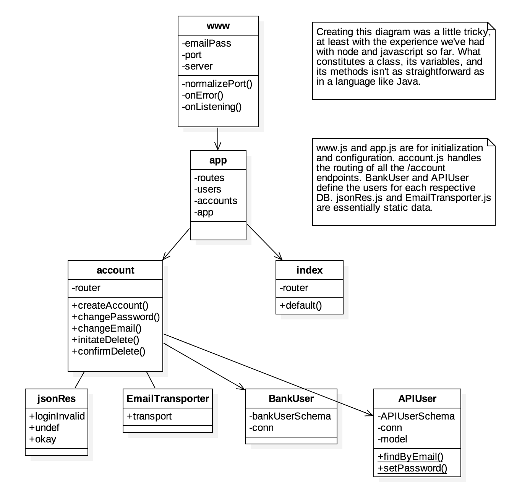

# UTSA CS 4733 Project

This was a Software Engineering course project. It implements a RESTful API for a mock bank system using Node, Express, and MongoDB. It's setup to run using Docker and Docker Compose.

## Project Hierarchy
- /bin/www *inital startup script*
- /docs *info for front-end teams*
- /misc *miscellanous scripts and info*
- /modules *javascript classes*
- /public *folder for static resources, CSS, images, etc.*
- /routes *logic to route and handle endpoints*
- /app.js *express configuration*
- /docker-compose.yml *for Docker, used to launch app*
- /Dockerfile *for Docker, used to build node.js image*
- package.json *install config for NPM modules*

There a few directories named unused that contain code that wasn't in use by
the running app by the end of the project.

**Assuming Bash on Linux or OS X. Idk what Windows is.**

You need to create modify the email in this
[file](modules/emailTransporter.js)
to an gMail you can access. Create a file called `.env` with
`EMAIL_PASS=your_password` in the root of the project directory. If you don't do
this the app won't start.

To run the app on your own. Setup Docker as per these
[instructions](misc/setup.md)
and run `docker-compose up -d`from the root directory of the project.

**You need to load the bank users into DB before testing.**

To load the fake bank info into the DB run `source misc/populate_db.sh` from
the root directory of the project.

**Messaging was worked on in the testing branch but was not debugged in time
for project submission.**

We made a
[sample Android app]( https://github.com/mirzasohailbaig/Android-Rest-FrontEnd-CS4773)
to test the api.
